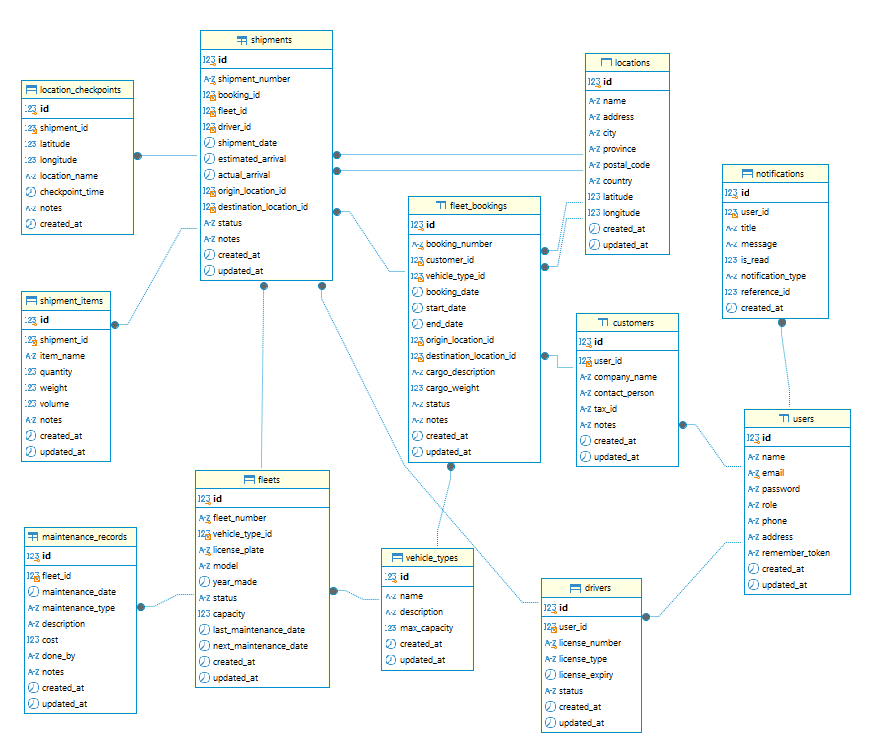

# BCL-Tracking

BCL-Tracking adalah aplikasi pelacakan pengiriman dan manajemen armada berbasis Laravel 10 yang menggunakan MySQL sebagai database dan Filament sebagai panel admin. Aplikasi ini memungkinkan manajemen armada, pelacakan pengiriman, serta pemesanan armada.

## Prasyarat

Sebelum memulai, pastikan bahwa kamu memiliki hal-hal berikut:

- PHP 8.1 atau lebih tinggi
- Composer
- MySQL (versi 5.7 atau lebih tinggi)

## Diagram Struktur Database

Di bawah ini adalah diagram struktur database untuk aplikasi BCL-Tracking.




## Langkah-langkah Instalasi

Ikuti langkah-langkah di bawah ini untuk menginstal dan menjalankan aplikasi ini secara lokal.

### 1. Clone Repository

Clone repository ini ke dalam direktori lokal kamu menggunakan git.

```bash
git clone https://github.com/RendyAFS/fs_bcl_Rendy_Adi_Fatma_Saputra.git


cd fs_bcl_Rendy_Adi_Fatma_Saputra

# Install dependencies PHP (Composer)
composer install


cp .env.example .env


php artisan key:generate


# Jalankan migrasi untuk membuat tabel-tabel di database
php artisan migrate

# Jalankan seeder untuk memasukkan data pengguna (admin, staff, dll)
php artisan db:seed

php artisan serve
